# Class Diagram - Hệ thống Quản lý Kiểm soát Ra Vào NFC

## Sơ đồ lớp tổng quan

```mermaid
classDiagram
    %% ==================== BACKEND CLASSES ====================
    
    class AuthController {
        +login(req, res, next)
        +register(req, res, next)
        +logout(req, res, next)
        +getCurrentUser(req, res, next)
    }
    
    class AuthService {
        -firebaseAuth
        +login(email, password) Promise~Object~
        +register(email, password, displayName) Promise~Object~
        +logout(token) Promise~void~
        +getUserById(uid) Promise~Object~
    }
    
    class UserController {
        +getUsers(req, res, next)
        +getUserById(req, res, next)
        +createUser(req, res, next)
        +updateUser(req, res, next)
        +deleteUser(req, res, next)
    }
    
    class UserService {
        +getAll(limit, offset) Promise~Array~
        +getById(userId) Promise~Object~
        +create(userData) Promise~Object~
        +update(userId, userData) Promise~Object~
        +delete(userId) Promise~void~
        +searchByEmail(email) Promise~Array~
    }
    
    class CardController {
        +createCard(req, res, next)
        +getCards(req, res, next)
        +assignCardToUser(req, res, next)
        +updateCard(req, res, next)
        +deleteCard(req, res, next)
    }
    
    class CardService {
        +createCard(deviceId, cardUid) Promise~Object~
        +assignToUser(cardId, userId, policy) Promise~Object~
        +getById(cardId) Promise~Object~
        +getByUid(cardUid) Promise~Object~
        +getByUserId(userId) Promise~Array~
        +update(cardId, data) Promise~Object~
        +delete(cardId) Promise~void~
    }
    
    class DeviceController {
        +registerDevice(req, res, next)
        +getConfig(req, res, next)
        +heartbeat(req, res, next)
    }
    
    class DeviceService {
        +registerDevice(data) Promise~Object~
        +getConfig(deviceId) Promise~Object~
        +updateHeartbeat(deviceId) Promise~void~
        +getAll() Promise~Array~
        +updateStatus(deviceId, status) Promise~void~
    }
    
    class AccessController {
        +checkAccess(req, res, next)
        +logBatch(req, res, next)
        +getLogs(req, res, next)
        +getStats(req, res, next)
    }
    
    class AccessService {
        +checkAccess(cardId, cardUid, credential) Promise~Object~
        +logAccess(data) Promise~Object~
        +logBatch(logs) Promise~void~
        +getLogs(filters) Promise~Array~
        +getStats(dateRange) Promise~Object~
    }
    
    class CredentialService {
        +generateCredential(card, user, options) Object
        +verifyCredential(credentialRaw, cardUid) Object
        +shouldRotateCredential(payload) Boolean
        +getPublicKey() String
    }
    
    class FirebaseService {
        -database
        +getAll(path) Promise~Array~
        +getById(path, id) Promise~Object~
        +create(path, data) Promise~Object~
        +createWithId(path, id, data) Promise~Object~
        +update(path, data) Promise~void~
        +delete(path, id) Promise~void~
        +query(path, filters) Promise~Array~
    }
    
    class AuthMiddleware {
        +authMiddleware(req, res, next)
        +optionalAuthMiddleware(req, res, next)
    }
    
    class DeviceAuthMiddleware {
        +deviceAuthMiddleware(req, res, next)
    }
    
    class ValidationMiddleware {
        +validateBody(schema) Function
        +validateParams(schema) Function
        +validateQuery(schema) Function
    }
    
    %% ==================== FRONTEND CLASSES ====================
    
    class ApiService {
        -baseUrl: String
        -eventSource: EventSource
        +getToken() String
        +setToken(token) void
        +clearToken() void
        +request(endpoint, options) Promise~Object~
        +login(email, password) Promise~Object~
        +logout() Promise~void~
        +getUsers(params) Promise~Array~
        +getCards() Promise~Array~
        +getDoors() Promise~Array~
        +getAccessLogs(params) Promise~Array~
        +subscribeToEvents(callback) Function
    }
    
    class AuthContext {
        -currentUser: Object
        -loading: Boolean
        -error: String
        +login(email, password) Promise~void~
        +logout() Promise~void~
        +getCurrentUser() Object
    }
    
    class useUsers {
        -users: Array
        -cards: Array
        -loading: Boolean
        -error: String
        +fetchUsers() Promise~void~
        +addUser(userData) Promise~void~
        +updateUser(userId, data) Promise~void~
        +deleteUser(userId) Promise~void~
    }
    
    class useDoorStatus {
        -doors: Array
        -loading: Boolean
        -error: String
        +fetchDoors() Promise~void~
        +sendCommand(doorId, command) Promise~void~
        +subscribeToDoorEvents() void
    }
    
    class useAccessLogs {
        -logs: Array
        -stats: Object
        -loading: Boolean
        +fetchLogs(filters) Promise~void~
        +fetchStats(dateRange) Promise~void~
    }
    
    %% ==================== DATA MODELS ====================
    
    class User {
        +id: String
        +email: String
        +displayName: String
        +phoneNumber: String
        +role: String
        +status: String
        +createdAt: Date
        +updatedAt: Date
    }
    
    class Card {
        +card_id: String
        +card_uid: String
        +user_id: String
        +scope: Array
        +status: String
        +enroll_mode: Boolean
        +offline_enabled: Boolean
        +credential: Object
        +createdAt: Date
        +updatedAt: Date
    }
    
    class Device {
        +device_id: String
        +hardware_type: String
        +firmware_version: String
        +door_id: String
        +status: String
        +last_heartbeat: Date
        +config: Object
        +createdAt: Date
    }
    
    class Door {
        +door_id: String
        +name: String
        +location: String
        +device_id: String
        +status: String
        +lastActivity: Date
    }
    
    class AccessLog {
        +id: String
        +user_id: String
        +card_id: String
        +door_id: String
        +device_id: String
        +access_granted: Boolean
        +reason: String
        +timestamp: Date
        +offline_log: Boolean
    }
    
    class Credential {
        +format: String
        +alg: String
        +raw: String
        +exp: Date
    }
    
    %% ==================== RELATIONSHIPS ====================
    
    %% Controllers depend on Services
    AuthController --> AuthService : uses
    UserController --> UserService : uses
    CardController --> CardService : uses
    DeviceController --> DeviceService : uses
    AccessController --> AccessService : uses
    
    %% Services depend on FirebaseService
    AuthService --> FirebaseService : uses
    UserService --> FirebaseService : uses
    CardService --> FirebaseService : uses
    DeviceService --> FirebaseService : uses
    AccessService --> FirebaseService : uses
    
    %% Services dependencies
    AccessService --> CardService : uses
    AccessService --> UserService : uses
    AccessService --> CredentialService : uses
    CardService --> CredentialService : uses
    
    %% Middleware dependencies
    AuthMiddleware --> AuthService : uses
    DeviceAuthMiddleware --> DeviceService : uses
    
    %% Frontend dependencies
    AuthContext --> ApiService : uses
    useUsers --> ApiService : uses
    useDoorStatus --> ApiService : uses
    useAccessLogs --> ApiService : uses
    
    %% Data Model relationships
    User "1" --> "0..*" Card : owns
    Card "1" --> "1" Credential : has
    Door "1" --> "1" Device : controlled by
    AccessLog "*" --> "1" User : performed by
    AccessLog "*" --> "1" Door : accessed
    AccessLog "*" --> "1" Card : used
    
    %% Composition
    Card *-- Credential : contains
```



## Chi tiết Classes

### Backend Controllers (Presentation Layer)

**AuthController**
- Xử lý HTTP requests cho authentication
- Endpoint: `/api/auth/*`
- Methods: login, register, logout, getCurrentUser

**UserController**
- Quản lý CRUD operations cho users
- Endpoint: `/api/users/*`
- Methods: getUsers, getUserById, createUser, updateUser, deleteUser

**CardController**
- Quản lý thẻ NFC
- Endpoint: `/api/v1/cards/*`
- Methods: createCard, getCards, assignCardToUser, updateCard, deleteCard

**DeviceController**
- Quản lý thiết bị ESP32
- Endpoint: `/api/v1/device/*`
- Methods: registerDevice, getConfig, heartbeat

**AccessController**
- Kiểm soát truy cập và logs
- Endpoint: `/api/v1/access/*`, `/api/access/*`
- Methods: checkAccess, logBatch, getLogs, getStats

---

### Backend Services (Business Logic Layer)

**AuthService**
- Authentication với Firebase
- Generate/verify JWT tokens
- User session management

**UserService**
- CRUD operations cho users
- Search và filter users
- Validation business rules

**CardService**
- Card enrollment workflow
- Assign cards to users
- Manage card policies và scope

**DeviceService**
- Device registration
- Configuration management
- Heartbeat monitoring

**AccessService**
- Verify access permissions
- Check credential validity
- Log access events
- Generate statistics

**CredentialService**
- Generate EdDSA credentials (JWT)
- Verify credential signatures
- Credential rotation logic
- Public/private key management

**FirebaseService**
- Abstract Firebase Realtime DB operations
- Generic CRUD methods
- Query builder

---

### Backend Middleware

**AuthMiddleware**
- Verify JWT token từ frontend
- Check token blacklist
- Attach user info to request

**DeviceAuthMiddleware**
- Verify device token từ ESP32
- Validate device permissions

**ValidationMiddleware**
- Validate request body/params/query
- Sử dụng Joi schema validation

---

### Frontend Services & Hooks

**ApiService**
- Central HTTP client
- Token management
- SSE subscription
- Error handling

**AuthContext**
- Global authentication state
- Login/logout functionality
- User session persistence

**useUsers**
- Manage users list
- CRUD operations
- Real-time updates via SSE

**useDoorStatus**
- Monitor door status
- Send door commands
- Real-time door events

**useAccessLogs**
- Fetch access logs
- Filter và pagination
- Statistics dashboard data

---

### Data Models

**User**
```javascript
{
  id: String,           // UUID
  email: String,        // Email address (unique)
  displayName: String,  // Full name
  phoneNumber: String,  // Phone number
  role: String,         // 'admin' | 'user'
  status: String,       // 'active' | 'inactive'
  createdAt: Date,
  updatedAt: Date
}
```

**Card**
```javascript
{
  card_id: String,         // c_xxxxxxxx
  card_uid: String,        // Hardware UID (unique)
  user_id: String,         // Reference to User
  scope: Array<String>,    // ['door_main', 'door_lab']
  status: String,          // 'active' | 'inactive'
  enroll_mode: Boolean,    // true during enrollment
  offline_enabled: Boolean,
  credential: {
    format: 'jwt',
    alg: 'EdDSA',
    raw: String,           // Signed JWT
    exp: Date
  },
  createdAt: Date,
  updatedAt: Date
}
```

**Device**
```javascript
{
  device_id: String,        // d_xxxxxxxx
  hardware_type: String,    // 'ESP32'
  firmware_version: String, // '1.0.0'
  door_id: String,          // Reference to Door
  status: String,           // 'active' | 'inactive' | 'offline'
  last_heartbeat: Date,
  config: {
    relay_open_ms: Number,
    offline_mode: {
      enabled: Boolean,
      cache_ttl_sec: Number
    }
  },
  createdAt: Date
}
```

**Door**
```javascript
{
  door_id: String,      // door_main, door_lab
  name: String,         // 'Main Entrance'
  location: String,     // 'Building A, Floor 1'
  device_id: String,    // Reference to Device
  status: String,       // 'locked' | 'unlocked' | 'error'
  lastActivity: Date
}
```

**AccessLog**
```javascript
{
  id: String,              // UUID
  user_id: String,         // Reference to User
  card_id: String,         // Reference to Card
  door_id: String,         // Reference to Door
  device_id: String,       // Reference to Device
  access_granted: Boolean, // true | false
  reason: String,          // 'valid' | 'expired' | 'invalid'
  timestamp: Date,
  offline_log: Boolean     // true if logged offline
}
```

**Credential (Embedded in Card)**
```javascript
{
  format: 'jwt',
  alg: 'EdDSA',           // Ed25519
  raw: String,            // JWT token
  exp: Date,              // Expiration time
  // Payload decoded:
  payload: {
    card_id: String,
    card_uid: String,
    iat: Number,
    exp: Number
  }
}
```

---

## Design Patterns

### 🎯 Layered Architecture
- **Presentation**: Controllers
- **Business Logic**: Services
- **Data Access**: FirebaseService
- **Cross-cutting**: Middleware, Utils

### 🏭 Factory Pattern
- `FirebaseService.create()` - Factory for creating documents
- `CredentialService.generateCredential()` - Credential factory

### 🔌 Repository Pattern
- `FirebaseService` - Generic repository
- Service classes - Specific repositories

### 🎭 Strategy Pattern
- Online vs Offline access check
- JWT (HS256) vs EdDSA (Ed25519)

### 🪝 Observer Pattern
- SSE (Server-Sent Events) for real-time updates
- React hooks subscribe to events

### 🔐 Middleware Chain Pattern
- Express middleware pipeline
- auth → validation → controller

---

**Generated for:** NFC Access Control System  
**Version:** 1.0  
**Date:** January 2026
