# Package Diagram - Hệ thống Quản lý Kiểm soát Ra Vào NFC

## Sơ đồ gói tổng quan

```mermaid
graph TB
    subgraph "Frontend Layer"
        WebUI["📱 Web Application<br/>(React + Vite)"]
        
        subgraph "Frontend Packages"
            FE_Pages["📄 Pages<br/>Dashboard, Users,<br/>History, Login"]
            FE_Components["🧩 Components<br/>Layout, Auth,<br/>Door, User"]
            FE_Contexts["🔄 Contexts<br/>AuthContext,<br/>ThemeContext"]
            FE_Hooks["🪝 Hooks<br/>useUsers, useDoorStatus,<br/>useAccessLogs"]
            FE_Services["🌐 Services<br/>ApiService"]
        end
    end
    
    subgraph "Backend Layer"
        API["🖥️ Backend API<br/>(Node.js + Express)"]
        
        subgraph "Backend Packages"
            BE_Routes["🛣️ Routes<br/>auth, users, cards,<br/>device, access, doors"]
            BE_Controllers["🎮 Controllers<br/>AuthController,<br/>UserController, etc."]
            BE_Services["⚙️ Services<br/>AuthService, CardService,<br/>DeviceService, etc."]
            BE_Middleware["🛡️ Middleware<br/>auth, deviceAuth,<br/>validation, rateLimiter"]
            BE_Config["⚙️ Config<br/>firebase, jwt, crypto,<br/>swagger, env"]
            BE_Utils["🔧 Utils<br/>logger, response,<br/>validators"]
        end
    end
    
    subgraph "Database Layer"
        Firebase["🔥 Firebase Realtime DB"]
        
        subgraph "Firebase Collections"
            DB_Users["👥 Users"]
            DB_Cards["💳 Cards"]
            DB_Devices["🔧 Devices"]
            DB_Doors["🚪 Doors"]
            DB_AccessLogs["📝 Access Logs"]
        end
    end
    
    subgraph "IoT Layer"
        ESP32["🔌 ESP32 Devices"]
        NFC["📡 NFC Reader<br/>(PN532/RC522)"]
    end
    
    subgraph "Security Layer"
        JWT["🔐 JWT (HS256)<br/>User Authentication"]
        EdDSA["🔒 EdDSA (Ed25519)<br/>Card Credentials"]
        DeviceToken["🎫 Device Token<br/>(JWT)"]
    end
    
    %% Frontend Internal Dependencies
    FE_Pages --> FE_Components
    FE_Pages --> FE_Hooks
    FE_Components --> FE_Contexts
    FE_Hooks --> FE_Services
    FE_Hooks --> FE_Contexts
    
    %% Backend Internal Dependencies
    BE_Routes --> BE_Controllers
    BE_Controllers --> BE_Services
    BE_Routes --> BE_Middleware
    BE_Services --> BE_Config
    BE_Services --> BE_Utils
    BE_Middleware --> BE_Config
    
    %% External Dependencies
    WebUI -->|HTTP/REST| API
    WebUI -->|SSE| API
    API -->|Firebase SDK| Firebase
    Firebase --> DB_Users
    Firebase --> DB_Cards
    Firebase --> DB_Devices
    Firebase --> DB_Doors
    Firebase --> DB_AccessLogs
    
    ESP32 -->|HTTP API v1| API
    ESP32 --> NFC
    
    BE_Services -.->|uses| JWT
    BE_Services -.->|uses| EdDSA
    BE_Services -.->|uses| DeviceToken
    FE_Services -.->|stores| JWT
    
    style WebUI fill:#90ee90,stroke:#228b22,stroke-width:2px
    style API fill:#87ceeb,stroke:#4169e1,stroke-width:2px
    style Firebase fill:#ffa500,stroke:#ff8c00,stroke-width:2px
    style ESP32 fill:#ffa07a,stroke:#ff4500,stroke-width:2px
    style JWT fill:#dda0dd,stroke:#9370db,stroke-width:2px
    style EdDSA fill:#dda0dd,stroke:#9370db,stroke-width:2px
    style DeviceToken fill:#dda0dd,stroke:#9370db,stroke-width:2px
```

## Chi tiết các gói

### 📱 Frontend Layer (React Application)

| Package | Trách nhiệm | Công nghệ |
|---------|-------------|-----------|
| **Pages** | Các trang chính của ứng dụng | React, React Router |
| **Components** | UI components tái sử dụng | React, Material-UI |
| **Contexts** | Global state management | React Context API |
| **Hooks** | Custom hooks cho logic tái sử dụng | React Hooks |
| **Services** | API communication layer | Fetch API, SSE |

### 🖥️ Backend Layer (Express API)

| Package | Trách nhiệm | Công nghệ |
|---------|-------------|-----------|
| **Routes** | API endpoint definitions | Express Router |
| **Controllers** | HTTP request handling | Express |
| **Services** | Business logic layer | JavaScript Classes |
| **Middleware** | Request processing pipeline | Express Middleware |
| **Config** | Configuration & utilities | JWT, Firebase Admin, Crypto |
| **Utils** | Helper functions | Winston Logger |

### 🔥 Database Layer (Firebase)

| Collection | Mô tả | Key Fields |
|------------|-------|-----------|
| **users** | Thông tin người dùng | id, email, name, role |
| **cards** | Thẻ NFC | card_id, card_uid, user_id, credential |
| **devices** | Thiết bị ESP32 | device_id, door_id, status |
| **doors** | Cửa ra vào | door_id, name, status |
| **access_logs** | Lịch sử truy cập | timestamp, user_id, door_id, result |

### 🔌 IoT Layer (ESP32)

| Component | Trách nhiệm | Giao tiếp |
|-----------|-------------|-----------|
| **ESP32** | Vi điều khiển chính | Wi-Fi, HTTP Client |
| **NFC Reader** | Đọc/ghi thẻ NFC | SPI/I2C |

### 🔐 Security Layer

| Component | Mục đích | Thuật toán |
|-----------|----------|-----------|
| **JWT User Auth** | Authentication admin/user | HS256 |
| **EdDSA Credentials** | Card credential signing | Ed25519 |
| **Device Token** | ESP32 authentication | HS256 JWT |

---

## Dependency Matrix

| From → To | Frontend | Backend | Database | IoT | Security |
|-----------|----------|---------|----------|-----|----------|
| **Frontend** | ✓ | HTTP/SSE | - | - | JWT |
| **Backend** | - | ✓ | Firebase SDK | HTTP API | JWT, EdDSA |
| **Database** | - | - | ✓ | - | - |
| **IoT** | - | HTTP | - | ✓ | EdDSA |
| **Security** | - | - | - | - | ✓ |

---

**Generated for:** NFC Access Control System  
**Version:** 1.0  
**Date:** January 2026
