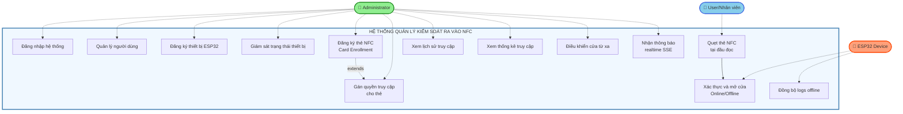
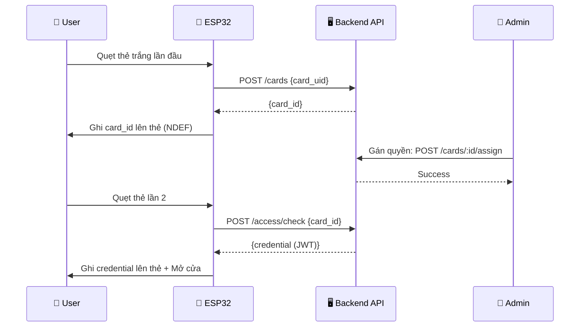
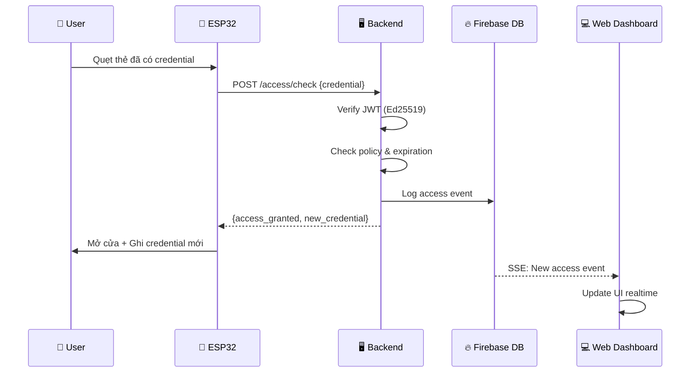
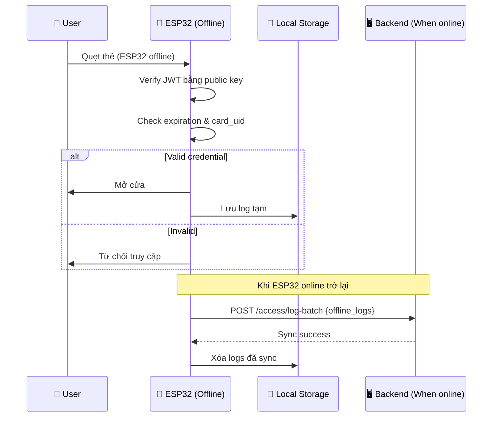

# Use Case Diagram - Hệ thống Quản lý Kiểm soát Ra Vào NFC

## Biểu đồ Use Case tổng quan

## Chi tiết Use Cases

### 👤 Administrator (Người quản trị)

| Use Case ID | Tên Use Case | Mô tả ngắn |
|-------------|--------------|------------|
| UC1 | Đăng nhập hệ thống | Admin đăng nhập bằng email/password, hệ thống cấp JWT token |
| UC2 | Quản lý người dùng | Thêm, sửa, xóa, xem danh sách người dùng trong hệ thống |
| UC3 | Đăng ký thiết bị ESP32 | Đăng ký thiết bị mới với secret key, cấp Device Token |
| UC4 | Giám sát trạng thái thiết bị | Xem trạng thái online/offline, heartbeat của các ESP32 |
| UC5 | Đăng ký thẻ NFC | Đăng ký thẻ trắng vào hệ thống, tạo card_id |
| UC6 | Gán quyền truy cập cho thẻ | Gán thẻ cho người dùng, thiết lập policy (cửa nào, thời gian) |
| UC7 | Xem lịch sử truy cập | Xem logs truy cập với filter theo user, cửa, thời gian |
| UC8 | Xem thống kê truy cập | Xem biểu đồ thống kê theo ngày/tuần/tháng |
| UC9 | Điều khiển cửa từ xa | Mở/khóa cửa khẩn cấp từ giao diện web |
| UC10 | Nhận thông báo realtime | Nhận thông báo sự kiện truy cập qua SSE |

### 👤 User/Nhân viên (Người dùng)

| Use Case ID | Tên Use Case | Mô tả ngắn |
|-------------|--------------|------------|
| UC11 | Quẹt thẻ NFC tại đầu đọc | Người dùng quẹt thẻ đã đăng ký để vào/ra khu vực |

### 🔧 ESP32 Device (Thiết bị)

| Use Case ID | Tên Use Case | Mô tả ngắn |
|-------------|--------------|------------|
| UC12 | Xác thực và mở cửa | Xác thực credential online (API) hoặc offline (public key) |
| UC13 | Đồng bộ logs offline | Tự động sync logs về server khi online trở lại |

## Luồng xử lý chính

### 🔄 Card Enrollment Flow

### 🔐 Access Control Flow

### 📡 Offline Mode Flow

## Quan hệ giữa các Use Cases

- **Include**: UC11 (Quẹt thẻ) → UC12 (Xác thực và mở cửa)
- **Extend**: UC5 (Đăng ký thẻ) ← UC6 (Gán quyền truy cập)
- **Generalization**: UC12 có 2 variants: Online mode và Offline mode

## Actors và vai trò

| Actor | Vai trò | Số lượng Use Cases |
|-------|---------|-------------------|
| Administrator | Quản lý toàn bộ hệ thống | 10 |
| User/Nhân viên | Sử dụng thẻ để truy cập | 1 |
| ESP32 Device | Xác thực và điều khiển cửa | 2 |

---

**Generated for:** NFC Access Control System  
**Version:** 1.0  
**Date:** January 2026
